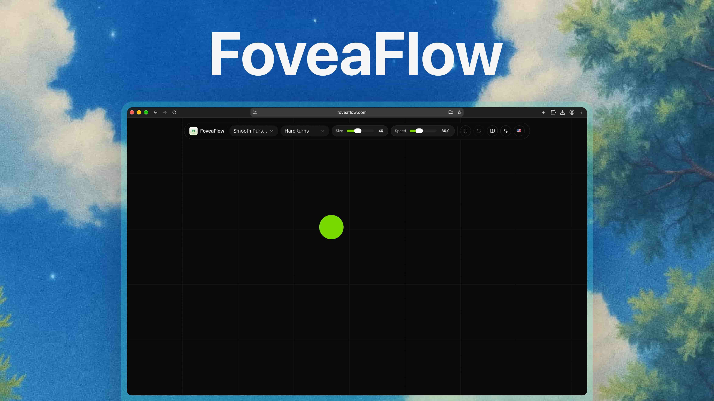

# FoveaFlow - Free Online Eye Trainer

[](https://foveaflow.com/)

[](https://astro.build/) [](https://svelte.dev/) [](https://www.typescriptlang.org/) [](https://bun.sh/) [](https://tailwindcss.com/) [](LICENSE)

[FoveaFlow](https://foveaflow.com/) is a free online eye trainer for visual tracking, quick refocus, peripheral awareness, and FPS warmups. It includes Smooth Pursuit paths, Reaction Jumps, Lilac Chaser peripheral focus practice, random motion, and distractor tracking.

It runs without an account or install. The app keeps the canvas full screen, gives direct control over target motion, and stores settings locally in your browser.

## What it does

- Runs four drills: Smooth Pursuit, Reaction Jumps, Multiple Distractions, and Lilac Chaser.
- Includes motion paths such as random, figure eight, bounce, sweeps, lissajous, and corner tour.
- Supports speed controls in `deg/s`, `cm/s`, and `screen/s`.
- Lets you tune target size, shape, color, opacity, trail behavior, distractor count, distractor brightness, and Lilac Chaser scale.
- Includes calibration settings for viewing distance and CSS pixels per centimeter.
- Stores settings locally in your browser.
- Uses a canvas renderer with light and dark themes.
- Keeps safety guardrails close to the engine, including saturated-red replacement and bounded frame timing.

## Background reading

- [Visual guidance of smooth pursuit eye movements](https://pmc.ncbi.nlm.nih.gov/articles/PMC2887486/)
- [Visual learning in multiple-object tracking](https://pmc.ncbi.nlm.nih.gov/articles/PMC2375111/)
- [Lilac chaser illusion](https://en.wikipedia.org/wiki/Lilac_chaser)
- [FPS Eye Training Warmup (HIGH FPS)](https://www.youtube.com/watch?v=WAPKAZhOFM4)

## Tech stack

- [Astro](https://astro.build/) for the app shell.
- [Svelte 5](https://svelte.dev/) for the trainer UI.
- [TypeScript](https://www.typescriptlang.org/) for application and engine code.
- [Tailwind CSS 4](https://tailwindcss.com/) for styling.
- [shadcn-svelte](https://www.shadcn-svelte.com/) and [bits-ui](https://bits-ui.com/) for UI primitives.
- [Bun](https://bun.sh/) for dependency management and scripts.

## Quick start

Requirements:

- Bun `1.3.14`
- Node.js `>=22.12.0` (`.node-version` selects Node.js 24 LTS)

Install dependencies:

```bash
bun install
```

Start the local dev server:

```bash
bun run dev
```

Astro serves the app at:

```text
http://127.0.0.1:4321
```

## Scripts

| Command | What it does |
| --- | --- |
| `bun run dev` | Starts the Astro dev server on `127.0.0.1`. |
| `bun run build` | Builds the production app. |
| `bun run preview` | Serves the built app locally. |
| `bun run check` | Runs `astro check`. |
| `bun run lint` | Checks code and formatting with Ultracite. |
| `bun run fix` | Applies Ultracite fixes and formats Astro files. |
| `bun run test` | Runs behavior and engine tests with Bun. |
| `bun run test:smoke` | Builds and runs desktop/mobile browser smoke tests. |
| `bun run verify` | Runs every required pre-deploy quality check. |
| `bun run format` | Formats supported files with Oxfmt and Astro files with Prettier. |

## Project structure

```text
src/pages/                 Astro routes
src/lib/components/        Svelte app and UI components
src/lib/trainer/           Trainer UI state, rendering, and settings helpers
src/lib/engine/            Training patterns, profiles, safety, storage
src/styles/                Global styles and Tailwind setup
public/metadata/           Generated icons and social images
tests/smoke/               Desktop and mobile browser smoke tests
```

## Quality checks

Run the same checks before shipping changes:

```bash
bun run format:svelte
bun run verify
```

Use `bun run format:svelte` when you only need to format source files after Svelte, Astro, TypeScript, or CSS edits.

## Safety note

FoveaFlow is practice software, not medical care. Stop if you feel eye strain, dizziness, headache, nausea, or any other discomfort. If you have an eye condition, light sensitivity, seizures, or recent eye surgery, ask a qualified clinician before using visual training tools.

## Roadmap

- Session history with basic progress stats.
- Guided routines for warmups, tracking, reaction drills, and cooldowns.
- Better calibration flow for screen size and viewing distance.
- Exportable presets.
- Demo GIF and short usage clips.

## License

MIT. See [LICENSE](LICENSE).
