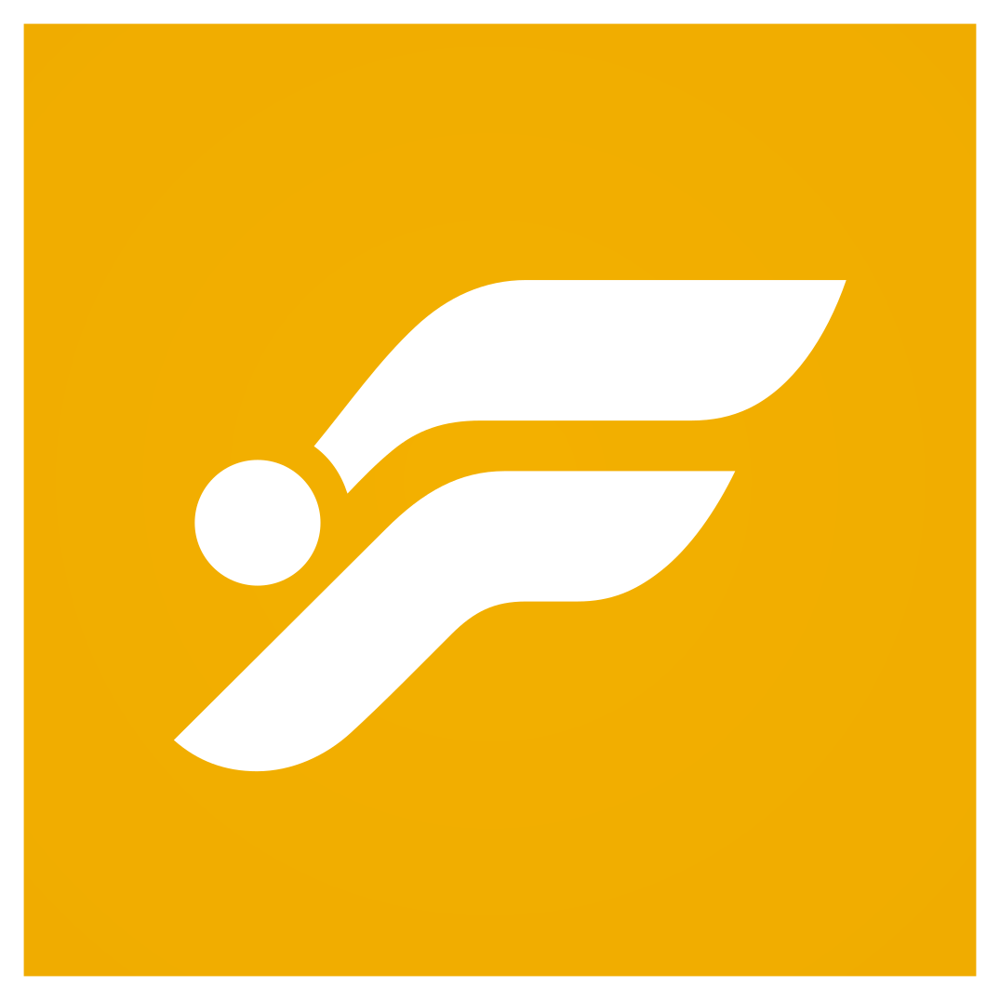

<p align="center">
  <a href="https://foveaflow.com/">
    
  </a>
</p>

<h1 align="center">FoveaFlow</h1>

<p align="center">
  <strong>Eye training, right in your browser.</strong><br />
  Follow a moving target, practice quick refocus, or hold your gaze through distractions.<br />
  Set the pace yourself.
</p>

<p align="center">
  <a href="https://foveaflow.com/"><strong>Open FoveaFlow ↗</strong></a>
  &nbsp; · &nbsp;
  <a href="https://foveaflow.com/guide/">Guide</a>
  &nbsp; · &nbsp;
  <a href="#run-locally">Run locally</a>
</p>

<p align="center">
  <sub>FREE TO USE &nbsp; / &nbsp; NO ACCOUNT &nbsp; / &nbsp; NO INSTALL</sub>
</p>

<p align="center">
  <a href="https://foveaflow.com/">
    
  </a>
</p>

## Pick a drill

<table>
  <tr>
    <td width="50%" valign="top">
      <sub>01 / TRACKING</sub>
      <h3>Smooth Pursuit</h3>
      <p>Follow one target along a moving path. Choose a steady sweep, a figure eight, or random motion.</p>
    </td>
    <td width="50%" valign="top">
      <sub>02 / REFOCUS</sub>
      <h3>Reaction Jumps</h3>
      <p>Find the target each time it jumps to a new position. Adjust the pace as you go.</p>
    </td>
  </tr>
  <tr>
    <td width="50%" valign="top">
      <sub>03 / DISTRACTIONS</sub>
      <h3>Multiple Distractions</h3>
      <p>Keep track of the brightest target among moving distractors. Control their number and brightness.</p>
    </td>
    <td width="50%" valign="top">
      <sub>04 / PERIPHERAL AWARENESS</sub>
      <h3>Lilac Chaser</h3>
      <p>Hold your gaze on the center while noticing changes around it. Tune the ring's scale and color.</p>
    </td>
  </tr>
</table>

## Make it comfortable

Start with a large target and a slow speed. Use the floating controls to adjust both while the drill runs.

| Adjust | What you control |
| :-- | :-- |
| Motion | Random paths, sweeps, figure eight, bounce, Lissajous, corner tour, and more. |
| Pace | Speed in `deg/s`, `cm/s`, or `screen/s`. |
| Target | Size, shape, color, opacity, and trails. |
| Calibration | Viewing distance and CSS pixels per centimeter. |
| Appearance | Light and dark themes, distractor brightness, and Lilac Chaser scale. |

Your settings stay in your browser and carry over to your next visit.

> FoveaFlow is practice software, not medical care. Stop if you feel eye strain, dizziness, headache, nausea, or other discomfort. If you have an eye condition, light sensitivity, seizures, or recent eye surgery, ask a qualified clinician before using visual training tools.

## Run locally

Use **Bun 1.4.1** and **Node.js 24**, as selected by `.node-version`. The minimum supported Node.js version is `22.12.0`.

```bash
bun install
bun run dev
```

Open [127.0.0.1:4321](http://127.0.0.1:4321).

The app uses [Astro](https://astro.build/) for its shell, [Svelte 5](https://svelte.dev/) for the controls, and a TypeScript canvas engine for the drills. [Tailwind CSS 4](https://tailwindcss.com/), [shadcn-svelte](https://www.shadcn-svelte.com/), and [Bits UI](https://bits-ui.com/) handle the interface.

<details>
<summary><strong>Development commands</strong></summary>

| Command | Purpose |
| :-- | :-- |
| `bun run dev` | Start the local Astro server. |
| `bun run build` | Build the production app and generate CSP headers. |
| `bun run preview` | Build and preview locally through Wrangler. |
| `bun run check` | Check Astro, Svelte, and application types. |
| `bun run check:tools` | Check tooling types. |
| `bun run check:i18n` | Check translation coverage. |
| `bun run lint` | Check code and formatting with Ultracite. |
| `bun run fix` | Apply Ultracite fixes and format Astro files. |
| `bun run format` | Format with Oxfmt and the Astro Prettier plugin. |
| `bun run test` | Build and run the release browser tests. |
| `bun run verify` | Run the full quality gate, including the dependency audit. |

`bun run test:release` runs the same suite as `bun run test`. `bun run prepush` runs the same checks as `bun run verify`.

</details>

<details>
<summary><strong>Checks and deployment</strong></summary>

Install the test browser and enable the pre-push hook once per clone:

```bash
bunx playwright install chromium
git config core.hooksPath .githooks
```

The hook runs lint, formatting, type checks, translation coverage, Tailwind diagnostics, the production build, browser tests, and a dependency audit.

The release suite checks every trainer route and public page on desktop and mobile Chromium. It exercises drill and path selection, canvas animation, pause/resume, settings, persistence, and reset. Browser errors and failed site resources fail the run; failure screenshots and traces land in `test-results/`.

Set `TEST_PORT` if the default test port, `4323`, is occupied. GitHub Actions runs the full verification on pull requests and deploys to Cloudflare after successful verification on `main`.

</details>

<details>
<summary><strong>Where things live</strong></summary>

```text
src/pages/                  Astro routes
src/lib/components/         Svelte app and UI components
src/lib/trainer/            Trainer state, rendering, and settings
src/lib/engine/             Patterns, profiles, safety, and storage
src/styles/                 Global styles and Tailwind setup
public/logo-render/         SVG logo
public/metadata/            App icons and social image
tests/release.playwright.ts Desktop and mobile release checks
```

</details>

<details>
<summary><strong>Ideas for later</strong></summary>

- Session history and basic progress stats.
- Guided routines for warmups, tracking, reaction drills, and cooldowns.
- A clearer calibration flow for screen size and viewing distance.
- Exportable presets.
- Short demo clips.

</details>

## Background reading

- [Visual guidance of smooth pursuit eye movements](https://pmc.ncbi.nlm.nih.gov/articles/PMC2887486/)
- [Visual learning in multiple-object tracking](https://pmc.ncbi.nlm.nih.gov/articles/PMC2375111/)
- [Lilac chaser illusion](https://en.wikipedia.org/wiki/Lilac_chaser)
- [FPS Eye Training Warmup](https://www.youtube.com/watch?v=WAPKAZhOFM4)

---

<p align="center">
  <a href="https://foveaflow.com/">foveaflow.com</a>
  &nbsp; · &nbsp;
  <a href="LICENSE">MIT license</a>
</p>
