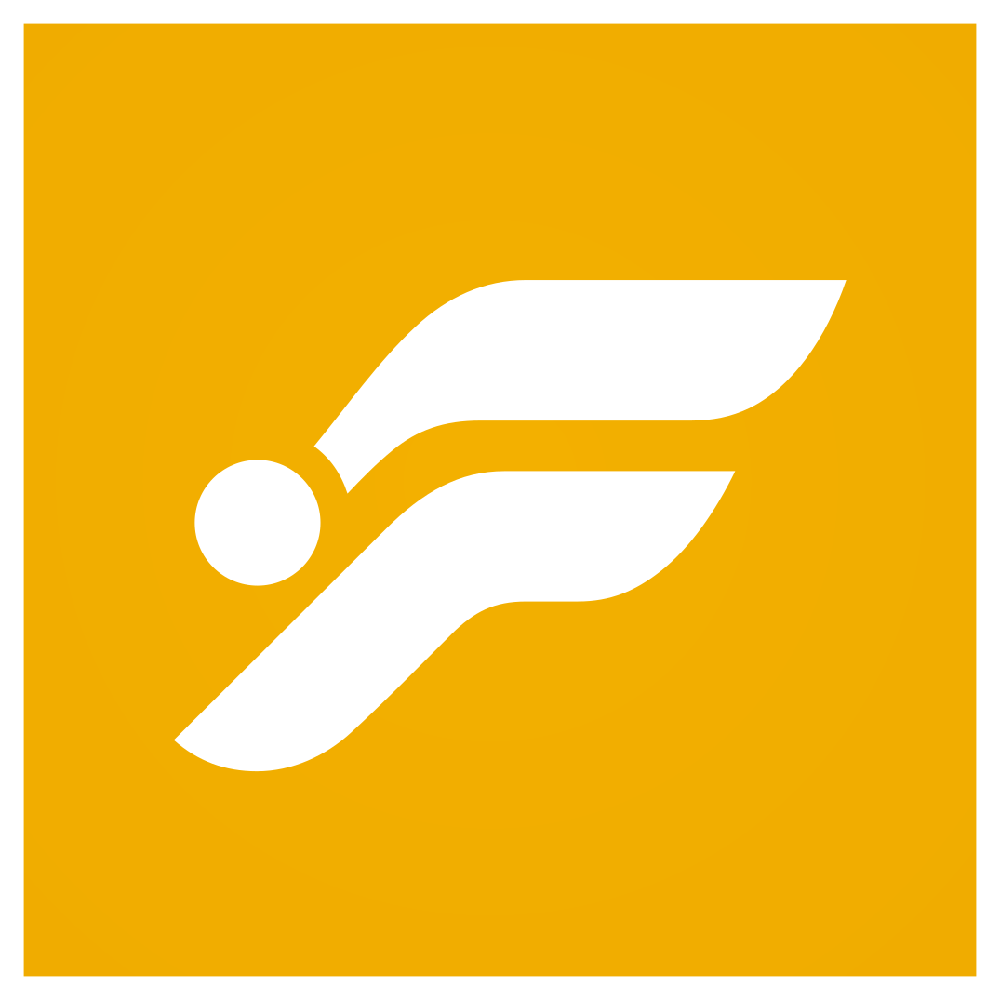

<a href="https://foveaflow.com/">
  
</a>

<h3 align="center">Eye training, right in your browser.</h3>

<p align="center">
  Follow a moving target, practice quick refocus, or hold your gaze through distractions. Set the pace yourself.<br />
  It's free, and there's no account or install.
</p>

<p align="center">
  <a href="https://foveaflow.com/"><picture><source media="(prefers-color-scheme: dark)" srcset="docs/images/buttons/open-dark.avif" /></picture></a>
  &nbsp;
  <a href="https://foveaflow.com/guide/"><picture><source media="(prefers-color-scheme: dark)" srcset="docs/images/buttons/guide-dark.avif" /></picture></a>
</p>

<p align="center">
  <a href="https://github.com/Jesper-N/foveaflow/actions/workflows/deploy.yml"></a>
  
  <a href="LICENSE"></a>
</p>

## Pick a drill

Each drill has its own URL, so you can bookmark the one you use most.

<table>
  <tr>
    <td width="50%" valign="top">
      <a href="https://foveaflow.com/smooth-pursuit/"><picture><source media="(prefers-color-scheme: dark)" srcset="docs/images/drills/smooth-pursuit-dark.avif" /></picture></a>
      <h3>Smooth Pursuit</h3>
      <p>Follow one target along a moving path. Choose a steady sweep, a figure eight, or random motion.</p>
      <a href="https://foveaflow.com/smooth-pursuit/">Try this drill ↗</a>
    </td>
    <td width="50%" valign="top">
      <a href="https://foveaflow.com/reaction-jumps/"><picture><source media="(prefers-color-scheme: dark)" srcset="docs/images/drills/reaction-jumps-dark.avif" /></picture></a>
      <h3>Reaction Jumps</h3>
      <p>Find the target each time it jumps to a new position. Adjust the pace as you go.</p>
      <a href="https://foveaflow.com/reaction-jumps/">Try this drill ↗</a>
    </td>
  </tr>
</table>

<!-- Two one-row tables: GitHub stripes every second table row, which would tint the lower cards. -->
<table>
  <tr>
    <td width="50%" valign="top">
      <a href="https://foveaflow.com/multiple-distractions/"><picture><source media="(prefers-color-scheme: dark)" srcset="docs/images/drills/multiple-distractions-dark.avif" /></picture></a>
      <h3>Multiple Distractions</h3>
      <p>Keep track of the brightest target among moving distractors. Control their number and brightness.</p>
      <a href="https://foveaflow.com/multiple-distractions/">Try this drill ↗</a>
    </td>
    <td width="50%" valign="top">
      <a href="https://foveaflow.com/lilac-chaser/"><picture><source media="(prefers-color-scheme: dark)" srcset="docs/images/drills/lilac-chaser-dark.avif" /></picture></a>
      <h3>Lilac Chaser</h3>
      <p>Hold your gaze on the center while noticing changes around it. Tune the ring's scale and color.</p>
      <a href="https://foveaflow.com/lilac-chaser/">Try this drill ↗</a>
    </td>
  </tr>
</table>

## Make it comfortable

Start with a large target and a slow speed. Use the floating controls to adjust both while the drill runs.

<picture>
  <source media="(prefers-color-scheme: dark)" srcset="docs/images/settings-dark.avif" />
  
</picture>

| Setting | Options |
| :-- | :-- |
| Speed | 1 to 100 |
| Target size | 4 to 100 px |
| Target | Circle, ring, square, diamond, triangle, or cross. Color, opacity, trails, and letter overlays. |
| Motion | 20 paths, including sweeps, figure eight, bounce, Lissajous, and corner tour |
| Distractors | Up to 10, with adjustable brightness |
| Lilac Chaser | Ring scale and ball color |
| Interface | Light, dark, or system theme, in 10 languages |

Your settings stay in your browser and carry over to your next visit.

### Keyboard shortcuts

| Key | Action | Key | Action |
| :-- | :-- | :-- | :-- |
| <kbd>Space</kbd> | Pause or resume | <kbd>M</kbd> | Choose a drill |
| <kbd>←</kbd> <kbd>→</kbd> | Slower or faster | <kbd>P</kbd> | Choose a motion path |
| <kbd>↓</kbd> <kbd>↑</kbd> | Smaller or larger target | <kbd>S</kbd> | Open the controls |
| <kbd>D</kbd> | Switch between light and dark | <kbd>G</kbd> | Open the guide |

> [!IMPORTANT]
>
> FoveaFlow is practice software, not medical care. Stop if you feel eye strain, dizziness, headache, nausea, or other discomfort. If you have an eye condition, light sensitivity, seizures, or recent eye surgery, ask a qualified clinician before using visual training tools.

## Run locally

Use **Bun 1.4.1** and **Node.js 24**, as selected by `.node-version`. The minimum supported Node.js version is `22.12.0`.

```bash
bun install
bun run dev
```

Open [127.0.0.1:4321](http://127.0.0.1:4321).

The app uses [Astro](https://astro.build/) for its shell, [Svelte 5](https://svelte.dev/) for the controls, and a TypeScript canvas engine for the drills. [Tailwind CSS 4](https://tailwindcss.com/), [shadcn-svelte](https://www.shadcn-svelte.com/), and [Bits UI](https://bits-ui.com/) handle the interface.

<details>
<summary><strong>Development commands</strong></summary>
<br />

| Command | Purpose |
| :-- | :-- |
| `bun run dev` | Start the local Astro server. |
| `bun run build` | Build the production app and generate CSP headers. |
| `bun run preview` | Build and preview locally through Wrangler. |
| `bun run check` | Check Astro, Svelte, and application types. |
| `bun run check:tools` | Check tooling types. |
| `bun run check:i18n` | Check translation coverage. |
| `bun run lint` | Check code and formatting with Ultracite. |
| `bun run fix` | Apply Ultracite fixes and format Astro files. |
| `bun run format` | Format with Oxfmt and the Astro Prettier plugin. |
| `bun run test` | Build and run the release browser tests. |
| `bun run verify` | Run the full quality gate, including the dependency audit. |

`bun run test:release` runs the same suite as `bun run test`. `bun run prepush` runs the same checks as `bun run verify`.

</details>

<details>
<summary><strong>Checks and deployment</strong></summary>
<br />

Install the test browser and enable the pre-push hook once per clone:

```bash
bunx playwright install chromium
git config core.hooksPath .githooks
```

The hook runs lint, formatting, type checks, translation coverage, Tailwind diagnostics, the production build, browser tests, and a dependency audit.

The release suite checks every trainer route and public page on desktop and mobile Chromium. It exercises drill and path selection, canvas animation, pause/resume, settings, persistence, and reset. Browser errors and failed site resources fail the run; failure screenshots and traces land in `test-results/`.

Set `TEST_PORT` if the default test port, `4323`, is occupied. GitHub Actions runs the full verification on pull requests and deploys to Cloudflare after successful verification on `main`.

</details>

<details>
<summary><strong>Where things live</strong></summary>
<br />

```text
src/pages/                  Astro routes
src/lib/components/         Svelte app and UI components
src/lib/trainer/            Trainer state, rendering, and settings
src/lib/engine/             Patterns, profiles, safety, and storage
src/styles/                 Global styles and Tailwind setup
public/logo-render/         SVG logo
public/metadata/            App icons and social image
docs/images/                README images
tests/release.playwright.ts Desktop and mobile release checks
```

</details>

<details>
<summary><strong>Ideas for later</strong></summary>
<br />

- Session history and basic progress stats.
- Guided routines for warmups, tracking, reaction drills, and cooldowns.
- Exportable presets.

</details>

## Background reading

- [Visual guidance of smooth pursuit eye movements](https://pmc.ncbi.nlm.nih.gov/articles/PMC2887486/)
- [Visual learning in multiple-object tracking](https://pmc.ncbi.nlm.nih.gov/articles/PMC2375111/)
- [Lilac chaser illusion](https://en.wikipedia.org/wiki/Lilac_chaser)
- [FPS Eye Training Warmup](https://www.youtube.com/watch?v=WAPKAZhOFM4)

<br />

<p align="center">
  <a href="https://foveaflow.com/"></a>
  <br />
  <sub><a href="https://foveaflow.com/">foveaflow.com</a> &nbsp;·&nbsp; <a href="LICENSE">MIT license</a></sub>
</p>
